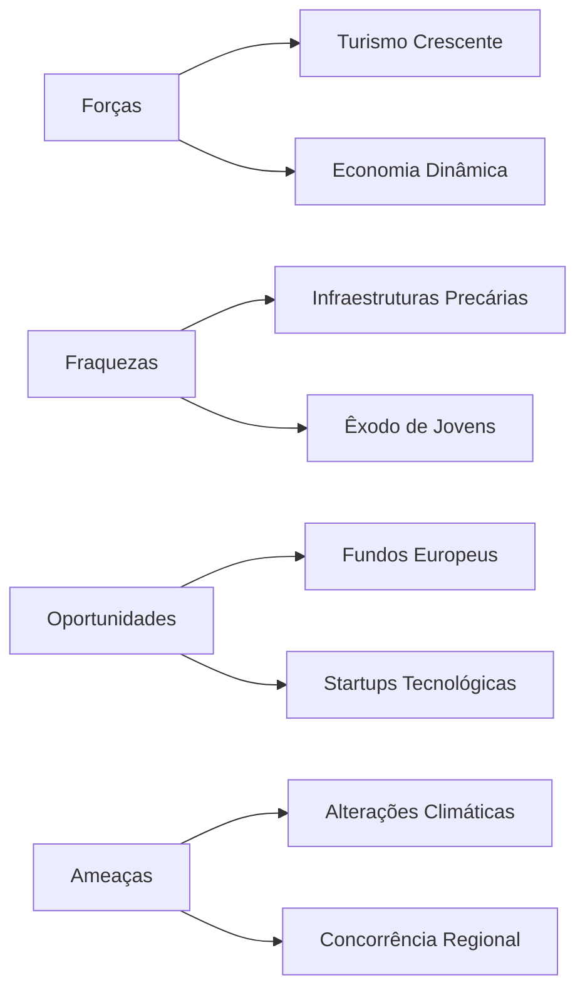

# Análise SWOT: Santa Maria da Feira

## Introdução
Santa Maria da Feira é uma região rica em história, cultura e com uma localização estratégica no norte de Portugal. Esta análise SWOT (Forças, Fraquezas, Oportunidades e Ameaças) tem como objetivo identificar os principais fatores internos e externos que impactam o desenvolvimento da região, fornecendo um guia para decisões estratégicas futuras.

---

## Pontos Fortes (Strengths)
| **Categoria**                       | **Descrição**                                                                   |
| ----------------------------------- | ------------------------------------------------------------------------------- |
| **Património Cultural e Histórico** | Castelo de Santa Maria da Feira e eventos como a Viagem Medieval e Imaginarius. |
| **Localização Estratégica**         | Proximidade ao Porto, boa ligação rodoviária e ferroviária.                     |
| **Economia Dinâmica**               | Indústria diversificada (cortiça e calçado) e incentivo ao empreendedorismo.    |
| **Qualidade de Vida**               | Espaços verdes e sentido de comunidade.                                         |

---

## Fraquezas (Weaknesses)
| **Categoria**                     | **Descrição**                                                                 |
|-----------------------------------|-------------------------------------------------------------------------------|
| **Infraestruturas**               | Necessidade de modernização de transportes e acessibilidade.                  |
| **Desafios Económicos**           | Dependência de indústrias tradicionais e adaptação tecnológica lenta.          |
| **Questões Demográficas**         | Envelhecimento populacional e êxodo de jovens.                                |

---

## Oportunidades (Opportunities)
| **Categoria**                     | **Descrição**                                                                 |
|-----------------------------------|-------------------------------------------------------------------------------|
| **Turismo Crescente**             | Potencial em turismo sustentável e promoção de património.                    |
| **Investimentos Externos**        | Fundos europeus e parcerias público-privadas.                                 |
| **Inovação e Tecnologia**         | Desenvolvimento de startups e polos de inovação.                              |

---

## Ameaças (Threats)
| **Categoria**                     | **Descrição**                                                                 |
|-----------------------------------|-------------------------------------------------------------------------------|
| **Concorrência Regional**         | Competição com cidades vizinhas por investimentos e turismo.                  |
| **Riscos Ambientais**             | Pressões urbanísticas e alterações climáticas.                                |
| **Instabilidade Económica**       | Impacto de crises nacionais ou globais.                                       |

---

## Representação Visual

---

## Conclusão
Santa Maria da Feira destaca-se como uma região com grande potencial graças ao seu património, localização e dinâmico setor industrial. No entanto, enfrenta desafios relacionados com modernização de infraestruturas e diversificação económica. Aproveitar oportunidades em turismo, inovação e fundos europeus pode ajudar a mitigar as ameaças e a potenciar os pontos fortes da região. Um planeamento estratégico bem estruturado será essencial para garantir um crescimento sustentável e equilibrado.

---

**Nota:** Esta análise pode ser expandida com dados quantitativos e qualitativos adicionais para maior profundidade.
